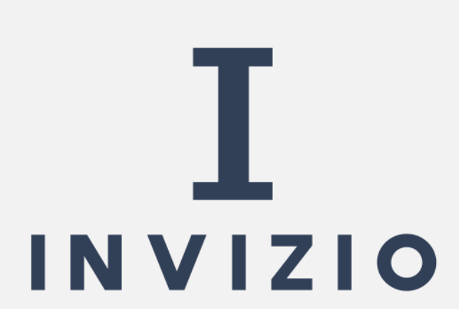
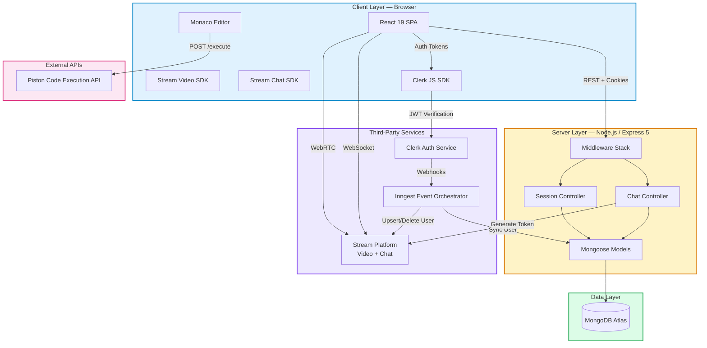
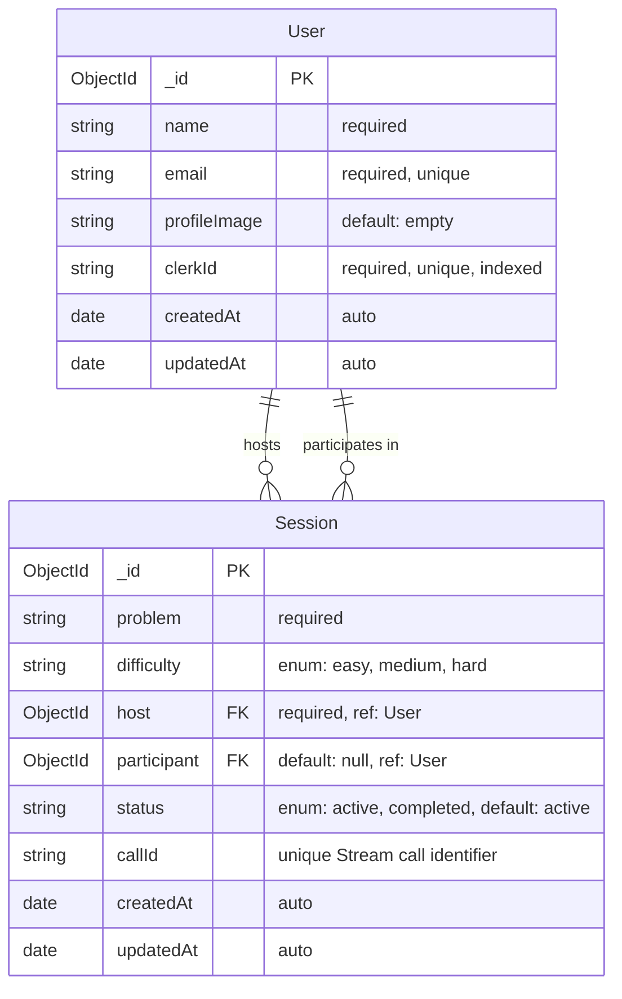
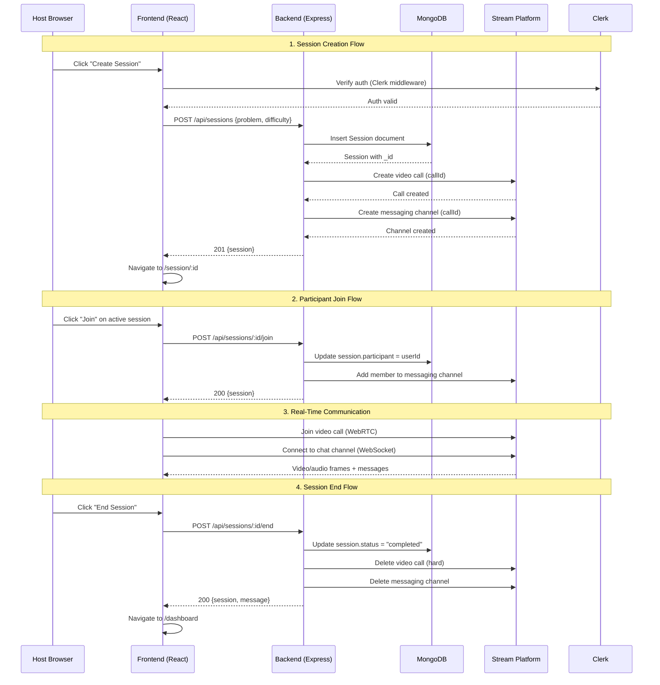
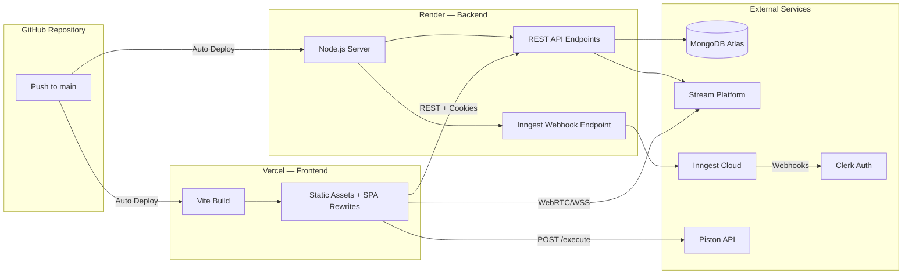

<div align="center">


<br />
<br />



# INVIZIO

**Real-time collaborative coding interview platform with live video, in-browser code execution, and integrated chat.**

[Live Demo](https://invizio-jzbi.onrender.com) &nbsp;&middot;&nbsp; [Report Bug](https://github.com/Hunterx15/INVIZIO/issues) &nbsp;&middot;&nbsp; [Request Feature](https://github.com/Hunterx15/INVIZIO/issues)

</div>

---

## Table of Contents

- [Project Overview](#project-overview)
- [Problem Statement](#problem-statement)
- [Features](#features)
- [Tech Stack](#tech-stack)
- [System Architecture](#system-architecture)
- [Folder Structure](#folder-structure)
- [Database Design](#database-design)
- [API Endpoints Overview](#api-endpoints-overview)
- [Installation & Setup](#installation--setup)
- [Environment Variables](#environment-variables)
- [Running Locally](#running-locally)
- [Deployment Guide](#deployment-guide)
- [Security Features](#security-features)
- [Performance Optimizations](#performance-optimizations)
- [Screenshots](#screenshots)
- [Future Enhancements](#future-enhancements)
- [Contributing Guidelines](#contributing-guidelines)
- [License](#license)
- [Author Information](#author-information)

---

## Project Overview

**INVIZIO** is a full-stack collaborative coding interview platform that enables two users to connect in a real-time video session, solve coding problems side-by-side using a built-in Monaco code editor, execute code in JavaScript, Python, or Java via the Piston API, and communicate through an integrated chat interface. The platform is designed to replicate and enhance the experience of technical interviews conducted on platforms like LeetCode or Pramp, but with a self-hostable, extensible architecture.

The application follows a monorepo structure with a React 19 + Vite 7 frontend and a Node.js + Express 5 backend. Authentication is handled entirely by Clerk, which also triggers serverless functions via Inngest to keep the MongoDB database and Stream service in sync. Real-time video and chat are powered by the Stream SDK, and code execution is delegated to the open-source Piston API to avoid maintaining sandboxed runtimes on the server.

The core session lifecycle works as follows: a host creates a session by selecting a problem and difficulty, which provisions a Stream video call and a messaging channel. A second user joins the session, gaining access to the same video call, chat, code editor, and problem description. The host can end the session at any time, which tears down the Stream resources and marks the session as completed.

---

## Problem Statement

Conducting effective remote coding interviews remains a fragmented experience. Interviewers typically juggle multiple tools — a video conferencing platform for face-to-face communication, a collaborative document or shared screen for the code editor, a separate chat for text-based discussion, and yet another service for recording or evaluating the session. This tool-switching creates friction, reduces interview quality, and makes it harder to focus on what matters: assessing a candidate's problem-solving ability.

Existing solutions like Pramp, Interviewing.io, and CoderPad address parts of this problem but come with trade-offs. Some lock you into proprietary scheduling systems, others charge per-session fees, and most do not allow self-hosting or customization. INVIZIO provides an open, self-hostable alternative that combines all critical interview tools — video calling, real-time chat, a production-grade code editor with multi-language execution, and a curated problem set — into a single, cohesive interface.

**Target Users:**

| User | Use Case |
|---|---|
| **Technical Interviewers** | Conduct structured coding interviews with built-in video, chat, and a runnable code editor without switching tools |
| **Engineering Candidates** | Practice real interview scenarios in a realistic, timed environment with multi-language support |
| **Coding Bootcamps & Educators** | Run pair-programming sessions and mock interviews for students in a controlled, observable setting |
| **Open-Source Contributors** | Extend the platform with custom problem sets, evaluation logic, or integrations |

---

## Features

| # | Feature | Description |
|---|---|---|
| 1 | **Clerk Authentication** | Secure, managed auth with sign-in/sign-up modals, protected routes, and user profile management — no custom auth logic required |
| 2 | **Real-Time HD Video Calls** | WebRTC-based video conferencing powered by Stream Video SDK with speaker layout, participant tracking, and call controls |
| 3 | **Integrated Chat** | Persistent messaging per session via Stream Chat SDK with dark theme, thread support, and real-time message delivery |
| 4 | **Monaco Code Editor** | VS Code-grade editor with syntax highlighting, IntelliSense, and configurable options embedded directly in the browser |
| 5 | **Multi-Language Code Execution** | Run JavaScript (v18), Python (v3.10), and Java (v15) code against test cases using the Piston execution engine |
| 6 | **Curated Problem Set** | Six DSA problems across Easy, Medium, and Hard difficulties with full descriptions, examples, constraints, and starter code in three languages |
| 7 | **Automated Test Validation** | Output normalization and comparison against expected results with confetti celebration on success and error feedback on failure |
| 8 | **Session Lifecycle Management** | Create, join, list, and terminate sessions with atomic state transitions and automatic Stream resource cleanup |
| 9 | **Auto-Sync User Provisioning** | Inngest serverless functions react to Clerk webhook events (`user.created`, `user.deleted`) to propagate user data to MongoDB and Stream in real time |
| 10 | **Resizable Panel Layout** | Drag-to-resize panels for the problem description, code editor, output console, video call, and chat — built with `react-resizable-panels` |
| 11 | **Dashboard with Live Metrics** | At-a-glance stats for active and completed sessions, with cards showing recent activity and one-click session creation |
| 12 | **Responsive UI with DaisyUI** | Consistent, themeable component library built on Tailwind CSS 4 with gradient accents, backdrop blur, and smooth transitions |

---

## Tech Stack

| Layer | Technology | Purpose |
|---|---|---|
| **Frontend Framework** | React 19 + Vite 7 | Component-based UI with sub-second HMR and optimized production builds |
| **Routing** | React Router v7 | Client-side routing with protected route redirects based on Clerk auth state |
| **Styling** | Tailwind CSS 4 + DaisyUI 5 | Utility-first CSS with pre-built accessible components and theme support |
| **State Management** | TanStack React Query v5 | Server state caching, automatic background refetching, and mutation handling |
| **Code Editor** | Monaco Editor (`@monaco-editor/react`) | Full-featured code editor with multi-language support, syntax highlighting, and IntelliSense |
| **Code Execution** | Piston API (`emkc.org`) | Serverless code execution sandbox supporting JavaScript, Python, and Java |
| **Authentication** | Clerk (`@clerk/clerk-react` + `@clerk/express`) | Managed auth provider handling sign-in, session tokens, and webhook delivery |
| **Real-Time Video** | Stream Video SDK (`@stream-io/video-react-sdk`) | WebRTC video calls with speaker layout and call lifecycle management |
| **Real-Time Chat** | Stream Chat (`stream-chat-react` v13) | Persistent messaging channels per session with dark theme and thread support |
| **Backend Runtime** | Node.js + Express 5 | REST API server with JSON parsing, CORS, and static file serving |
| **Database** | MongoDB + Mongoose 8 | Document store for users and sessions with schema validation and population |
| **Event Processing** | Inngest (`inngest/express`) | Serverless function orchestration for Clerk webhook-driven user sync |
| **HTTP Client** | Axios | Configured instance with `withCredentials` for cookie-based auth forwarding |
| **Icons** | Lucide React | Consistent, tree-shakable SVG icon set used across all UI components |
| **Notifications** | React Hot Toast | Non-intrusive toast notifications for success, error, and loading states |
| **Deployment** | Render (Backend) + Vercel (Frontend) | Cloud hosting with automatic builds from the GitHub repository |

---

## System Architecture



### Architecture Decisions

**Why Clerk over custom JWT auth?** Clerk eliminates the need to implement password hashing, session token rotation, email verification flows, and OAuth integrations from scratch. Its webhook system allows the backend to stay in sync without polling. The Express middleware (`@clerk/express`) adds a verified `req.auth()` object to every request, making route protection a one-liner.

**Why Stream over WebRTC from scratch?** Building a reliable WebRTC signaling server, handling ICE candidates, managing TURN/STUN servers, and implementing a chat system from the ground up would require months of engineering. Stream provides production-grade SDKs for both video and chat with built-in moderation, offline support, and horizontal scalability. The trade-off is a vendor dependency, but the development speed gain is substantial.

**Why Inngest for user sync?** Clerk webhooks need to be received and processed reliably. Inngest provides durable execution — if a function fails, it retries automatically with exponential backoff. This ensures that user records in MongoDB and Stream never drift from the source of truth in Clerk, even during transient network failures.

**Why Piston for code execution?** Running untrusted user code requires sandboxing at the kernel or container level. Rather than managing containers or WebAssembly sandboxes on the backend, INVIZIO delegates code execution to the open-source Piston API. This removes the security surface area entirely from the application server while supporting multiple language runtimes.

---

## Folder Structure

```
INVIZIO/
├── frontend/                          # React 19 SPA
│   ├── public/
│   │   ├── hero.png                   # Landing page hero illustration
│   │   ├── logo.png                   # INVIZIO brand logo
│   │   ├── javascript.png             # Language icon for editor toolbar
│   │   ├── python.png                 # Language icon for editor toolbar
│   │   └── java.png                   # Language icon for editor toolbar
│   ├── src/
│   │   ├── api/
│   │   │   └── sessions.js            # Axios-based session & chat API client
│   │   ├── components/
│   │   │   ├── ActiveSessions.jsx     # Live session cards with join/action buttons
│   │   │   ├── CodeEditorPanel.jsx    # Monaco editor wrapper with language selector
│   │   │   ├── CreateSessionModal.jsx # Modal form for problem & difficulty selection
│   │   │   ├── Navbar.jsx             # Top navigation with logo, links, and UserButton
│   │   │   ├── OutputPanel.jsx        # Code execution output console
│   │   │   ├── ProblemDescription.jsx # Problem details with navigation sidebar
│   │   │   ├── RecentSessions.jsx     # Completed sessions history list
│   │   │   ├── StatsCards.jsx         # Dashboard metric cards (active/recent counts)
│   │   │   ├── VideoCallUI.jsx        # Stream video + chat composite component
│   │   │   └── WelcomeSection.jsx     # Personalized dashboard hero with CTA
│   │   ├── data/
│   │   │   └── problems.js            # Problem definitions, starter code, and language config
│   │   ├── hooks/
│   │   │   ├── useSessions.js         # React Query hooks for all session CRUD operations
│   │   │   └── useStreamClient.js     # Stream Video + Chat initialization and cleanup hook
│   │   ├── lib/
│   │   │   ├── axios.js               # Configured Axios instance with baseURL and credentials
│   │   │   ├── piston.js              # Piston API client for multi-language code execution
│   │   │   ├── stream.js              # Stream Video client singleton with connect/disconnect
│   │   │   └── utils.js               # Shared utility functions (e.g., difficulty badge class)
│   │   ├── pages/
│   │   │   ├── DashboardPage.jsx      # Main dashboard with session management
│   │   │   ├── HomePage.jsx           # Public landing/marketing page
│   │   │   ├── ProblemPage.jsx        # Solo practice page with editor and test validation
│   │   │   ├── ProblemsPage.jsx       # Problem catalog with difficulty filters and stats
│   │   │   └── SessionPage.jsx        # Collaborative interview session with video + editor
│   │   ├── App.jsx                    # Root component with Clerk-gated route definitions
│   │   ├── index.css                  # Global styles and Tailwind directives
│   │   └── main.jsx                   # App entry point with providers (Clerk, Router, QueryClient)
│   ├── index.html                     # Vite HTML entry point
│   ├── vercel.json                    # Vercel SPA rewrite configuration
│   ├── vite.config.js                 # Vite config with React and Tailwind plugins
│   ├── eslint.config.js               # ESLint flat config
│   └── package.json
│
├── backend/                           # Express 5 REST API
│   └── src/
│       ├── controllers/
│       │   ├── chatController.js      # Stream token generation
│       │   └── sessionController.js   # Session CRUD with Stream resource management
│       ├── lib/
│       │   ├── db.js                  # Mongoose connection with error handling
│       │   ├── env.js                 # Typed environment variable access
│       │   ├── inngest.js             # Inngest functions for Clerk webhook user sync
│       │   └── stream.js              # Stream server-side client setup and user CRUD
│       ├── middleware/
│       │   └── protectRoute.js        # Clerk auth verification + DB user hydration
│       ├── models/
│       │   ├── Session.js             # Session schema (problem, host, participant, callId)
│       │   └── User.js                # User schema (name, email, clerkId, profileImage)
│       ├── routes/
│       │   ├── chatRoutes.js          # GET /token
│       │   └── sessionRoute.js        # Full session REST routes
│       └── server.js                  # Express app setup, middleware, and production static serving
│
├── package.json                       # Root monorepo scripts (build, start)
├── .gitignore                         # node_modules, .env, .DS_Store
└── README.md                          # This file
```

---

## Database Design

### Entity-Relationship Diagram



### Schema Details

**User Collection**

| Field | Type | Constraints | Description |
|---|---|---|---|
| `_id` | ObjectId | Auto-generated, PK | Internal MongoDB identifier |
| `name` | String | Required | Full name synced from Clerk (`first_name` + `last_name`) |
| `email` | String | Required, Unique | Primary email from Clerk |
| `profileImage` | String | Default: `""` | Avatar URL synced from Clerk |
| `clerkId` | String | Required, Unique | Foreign key to Clerk user — used as the canonical user identifier across all services |
| `createdAt` | Date | Auto (timestamps) | Record creation time |
| `updatedAt` | Date | Auto (timestamps) | Last modification time |

**Session Collection**

| Field | Type | Constraints | Description |
|---|---|---|---|
| `_id` | ObjectId | Auto-generated, PK | Internal MongoDB identifier |
| `problem` | String | Required | Display name of the coding problem (e.g., "Two Sum") |
| `difficulty` | String | Enum: `easy`, `medium`, `hard` | Problem difficulty level |
| `host` | ObjectId | Required, Ref: `User` | The user who created the session |
| `participant` | ObjectId | Default: `null`, Ref: `User` | The second user who joined — `null` until someone joins |
| `status` | String | Enum: `active`, `completed`, Default: `active` | Current session state |
| `callId` | String | Unique per session | Stream video call and chat channel identifier |
| `createdAt` | Date | Auto (timestamps) | Session creation time |
| `updatedAt` | Date | Auto (timestamps) | Last status change time |

---

## API Endpoints Overview

### API Flow Diagram



### Endpoint Reference

| Method | Endpoint | Auth | Description | Request Body | Response |
|---|---|---|---|---|---|
| `GET` | `/health` | No | Health check | — | `{ msg: "api is up and running" }` |
| `POST` | `/api/sessions` | Yes | Create a new interview session | `{ problem: string, difficulty: string }` | `{ session: Session }` — 201 |
| `GET` | `/api/sessions/active` | Yes | List up to 20 active sessions (sorted by newest) | — | `{ sessions: Session[] }` |
| `GET` | `/api/sessions/my-recent` | Yes | List up to 20 completed sessions where user is host or participant | — | `{ sessions: Session[] }` |
| `GET` | `/api/sessions/:id` | Yes | Get a single session with populated host and participant | — | `{ session: Session }` |
| `POST` | `/api/sessions/:id/join` | Yes | Join an active session as participant (max 1 participant) | — | `{ session: Session }` |
| `POST` | `/api/sessions/:id/end` | Yes | End a session (host only) — deletes Stream call and channel | — | `{ session: Session, message: string }` |
| `GET` | `/api/chat/token` | Yes | Generate a Stream JWT token for the authenticated user | — | `{ token: string, userId: string, userName: string, userImage: string }` |
| `POST` | `/api/inngest` | Inngest | Inngest webhook receiver for Clerk events | Clerk webhook payload | Inngest acknowledgment |

### Authentication Flow

Every protected endpoint passes through the `protectRoute` middleware chain:

1. **Clerk Verification** — `requireAuth()` from `@clerk/express` validates the JWT in the request cookies and rejects unauthenticated requests with `401`.
2. **Database Hydration** — The middleware queries MongoDB for the user record matching `clerkId` from the verified token and attaches the full `User` document to `req.user`.
3. **Controller Access** — Controllers access `req.user._id` (MongoDB ObjectId) for database operations and `req.user.clerkId` for Stream API calls, ensuring consistent identity across services.

---

## Installation & Setup

### Prerequisites

- **Node.js** >= 18.x
- **npm** >= 9.x
- **MongoDB Atlas** account (or a local MongoDB instance)
- **Clerk** account with a published application
- **Stream** account with API key and secret

### 1. Clone the Repository

```bash
git clone https://github.com/Hunterx15/INVIZIO.git
cd INVIZIO
```

### 2. Install Dependencies

```bash
# Install both frontend and backend dependencies
npm run build
```

This root-level script runs `npm install` in both `frontend/` (including dev dependencies for the build) and `backend/`, then builds the Vite production bundle.

### 3. Configure Environment Variables

Create the required `.env` files (see [Environment Variables](#environment-variables) section below).

### 4. Start the Development Server

```bash
# Terminal 1 — Backend
cd backend
npm run dev

# Terminal 2 — Frontend
cd frontend
npm run dev
```

The backend runs on `http://localhost:3000` (or your configured `PORT`) and the frontend on `http://localhost:5173`.

---

## Environment Variables

### Frontend — `frontend/.env.local`

| Variable | Required | Description |
|---|---|---|
| `VITE_CLERK_PUBLISHABLE_KEY` | Yes | Clerk publishable key for the frontend SDK (starts with `pk_test_`) |
| `VITE_API_URL` | Yes | Backend API base URL (e.g., `http://localhost:3000`) |
| `VITE_STREAM_API_KEY` | Yes | Stream API key used by the browser-side Video and Chat SDKs |

### Backend — `backend/.env`

| Variable | Required | Description |
|---|---|---|
| `PORT` | Yes | Server listen port (default: `3000`) |
| `DB_URL` | Yes | MongoDB connection string (Atlas SRV or local) |
| `NODE_ENV` | No | Set to `production` to enable static file serving from `frontend/dist` |
| `CLIENT_URL` | Yes | Frontend origin for CORS (e.g., `http://localhost:5173`) |
| `CLERK_SECRET_KEY` | Yes | Clerk secret key for backend token verification (starts with `sk_test_`) |
| `CLERK_PUBLISHABLE_KEY` | Yes | Clerk publishable key (used by Inngest for webhook verification) |
| `STREAM_API_KEY` | Yes | Stream API key for server-side SDK initialization |
| `STREAM_API_SECRET` | Yes | Stream API secret for generating JWT tokens |
| `INNGEST_EVENT_KEY` | Yes | Inngest event key for receiving Clerk webhooks |
| `INNGEST_SIGNING_KEY` | Yes | Inngest signing key for verifying webhook authenticity |

> **Important:** Never commit `.env` files to version control. The `.gitignore` at the repository root already excludes them.

---

## Running Locally

### Development Mode (Recommended)

Run the frontend and backend as separate processes with hot-reload enabled:

```bash
# Backend with nodemon auto-restart
cd backend && npm run dev

# Frontend with Vite HMR
cd frontend && npm run dev
```

### Production Mode (Single Server)

In production, the Express server serves the built Vite bundle as static files:

```bash
# Build the frontend
cd frontend && npm run build

# Start the backend (it serves frontend/dist in production)
cd backend && npm start
```

When `NODE_ENV=production`, the backend adds `express.static()` middleware pointing to `frontend/dist` and a catch-all route that serves `index.html` for all non-API paths, enabling client-side routing to work correctly.

### Solo Practice Mode

Navigate to `/problems` after signing in to access the standalone practice mode. This mode does not require a second participant — you can solve problems, run code, and validate output against expected results entirely on your own, with a confetti animation on success.

---

## Deployment Guide

### Deployment Architecture



### Frontend (Vercel)

1. Connect the GitHub repository to Vercel.
2. Set the **Root Directory** to `frontend`.
3. Configure environment variables in the Vercel dashboard (`VITE_CLERK_PUBLISHABLE_KEY`, `VITE_API_URL`, `VITE_STREAM_API_KEY`).
4. The `vercel.json` at `frontend/vercel.json` handles SPA rewrites automatically.

### Backend (Render)

1. Connect the same GitHub repository to Render.
2. Set the **Root Directory** to `backend`.
3. Set the **Build Command** to `npm install`.
4. Set the **Start Command** to `npm start` (runs `node src/server.js`).
5. Configure all backend environment variables in the Render dashboard.
6. Ensure the `CLIENT_URL` environment variable matches the Vercel deployment URL.

### Clerk Webhook Configuration

After deploying the backend, configure Clerk to send webhooks to Inngest:

1. In the Clerk Dashboard, go to **Webhooks** and add the endpoint: `https://your-backend.onrender.com/api/inngest`.
2. Subscribe to the `user.created` and `user.deleted` events.
3. Copy the **Signing Key** from Inngest and set it as `INNGEST_SIGNING_KEY` in your backend environment.

---

## Security Features

| Feature | Implementation |
|---|---|
| **Authentication** | Clerk manages the entire auth lifecycle — password hashing, session tokens, OAuth, and MFA. The backend never touches raw passwords. |
| **Route Protection** | Every API endpoint (except `/health`) passes through `protectRoute`, which verifies the Clerk JWT and hydrates the user from the database before the request reaches any controller. |
| **CORS Configuration** | CORS is locked to the explicit `CLIENT_URL` origin with `credentials: true`, preventing cross-origin requests from unauthorized domains. |
| **Authorization Checks** | Session endpoints enforce ownership rules: only the host can end a session, hosts cannot join their own sessions, and a session rejects a third participant with `409 Conflict`. |
| **Code Execution Sandboxing** | User code is executed on the remote Piston API, not on the application server. This completely isolates the backend from arbitrary code execution attacks. |
| **Environment Variable Isolation** | All secrets (database credentials, API keys, signing keys) are loaded from `.env` files that are excluded from version control via `.gitignore`. |
| **Stream Token Authentication** | Stream JWT tokens are generated server-side using the secret key and issued per-user, per-session. Clients cannot impersonate other users or access channels they are not members of. |
| **Webhook Verification** | Inngest signing keys verify that incoming webhook payloads are genuinely from Clerk, preventing replay or injection attacks. |

---

## Performance Optimizations

| Optimization | Detail |
|---|---|
| **Vite Production Build** | Vite generates highly optimized static assets with tree-shaking, code splitting, and CSS minification. The `@tailwindcss/vite` plugin processes styles at build time rather than runtime. |
| **TanStack React Query Caching** | Server state is cached in memory with automatic stale-while-revalidate. The `useSessionById` hook polls every 5 seconds to detect session status changes without full page reloads. |
| **Monaco Editor Lazy Loading** | The Monaco Editor package loads the editor core and language grammars on demand, reducing the initial JavaScript bundle size. |
| **Stream Client Singleton** | The video client is instantiated once and reused across sessions. On re-initialization, the previous connection is properly disconnected to prevent memory leaks and zombie WebRTC connections. |
| **Mongoose Query Optimization** | Session list queries use `.limit(20)` with `.sort({ createdAt: -1 })` and `.populate()` with field projection (`"name profileImage email clerkId"`), avoiding full document transfers. |
| **CORS Credentials Forwarding** | The Axios instance is configured with `withCredentials: true` so Clerk session cookies are sent automatically, avoiding redundant auth token exchanges on every request. |
| **React-Resizable-Panels** | Panel layout changes are handled entirely in CSS without triggering React re-renders, providing smooth drag-to-resize behavior even on lower-end devices. |
| **Conditional Rendering** | Auth-gated routes use early `Navigate` redirects before mounting protected components, preventing unnecessary API calls and render cycles for unauthenticated users. |

---

## Screenshots

> Screenshots showcase the core INVIZIO experience across all major pages.

| Page | Description |
|---|---|
| **Landing Page** | Marketing homepage with hero section, feature highlights, stats, and call-to-action |
| **Dashboard** | Personalized welcome, active sessions feed, recent session history, and quick session creation |
| **Problems Catalog** | Browse all coding problems with difficulty badges, category tags, and aggregate statistics |
| **Problem Practice** | Solo practice view with resizable problem description, Monaco editor, and live output panel |
| **Collaborative Session** | Split-panel interview layout — code editor + problem on the left, HD video call + chat on the right |

---

## Future Enhancements

- **Whiteboard Integration** — Add a real-time collaborative whiteboard (e.g., Excalidraw) for diagramming and system design discussions during sessions.
- **Session Recording & Playback** — Record video, audio, and code changes for post-interview review and candidate evaluation.
- **AI-Powered Code Analysis** — Integrate an LLM to provide real-time hints, detect bugs, or generate solution explanations during the session.
- **Custom Problem Sets** — Allow interviewers to create and import their own problems with custom test cases and expected outputs.
- **Rating & Feedback System** — Post-session rating forms for both host and participant to collect structured interview feedback.
- **Calendar Scheduling** — Integrate Google Calendar or Calendly to schedule sessions in advance and send automated reminders.
- **Role-Based Access Control** — Support for admin, interviewer, and candidate roles with granular permissions on problems and sessions.
- **Multi-Participant Sessions** — Extend beyond 1:1 to support panel interviews with multiple interviewers and observers.
- **Code Snippet Sharing** — Allow participants to share code snapshots or solutions via generated links after a session ends.
- **Comprehensive Test Runner** — Add a test case management panel where interviewers can define custom inputs/outputs and run them individually.

---

## Contributing Guidelines

Contributions are welcome and encouraged. To contribute:

1. **Fork** the repository and create a feature branch from `main`.
2. **Follow** the existing code style — the project uses ESLint with the React hooks plugin. Run `npm run lint` in the `frontend/` directory before committing.
3. **Write** meaningful commit messages. Reference the issue number if applicable (e.g., `feat: add whiteboard component (#42)`).
4. **Test** your changes thoroughly. Verify that both `npm run dev` (frontend and backend) and `npm run build` succeed without errors.
5. **Open** a Pull Request with a clear description of the changes, the problem they solve, and any relevant screenshots.

### Development Workflow

```bash
# 1. Fork and clone
git clone https://github.com/your-username/INVIZIO.git
cd INVIZIO

# 2. Create a feature branch
git checkout -b feature/your-feature-name

# 3. Make changes and test
cd frontend && npm run lint
cd ../backend && npm run dev

# 4. Commit and push
git add .
git commit -m "feat: describe your change"
git push origin feature/your-feature-name

# 5. Open a Pull Request on GitHub
```

---

## License

This project is licensed under the **MIT License**. You are free to use, copy, modify, merge, publish, distribute, sublicense, and/or sell copies of the software, provided that the copyright notice and permission notice are included in all copies or substantial portions of the software.

```
MIT License

Copyright (c) 2025 INVIZIO

Permission is hereby granted, free of charge, to any person obtaining a copy
of this software and associated documentation files (the "Software"), to deal
in the Software without restriction, including without limitation the rights
to use, copy, modify, merge, publish, distribute, sublicense, and/or sell
copies of the Software, and to permit persons to whom the Software is
furnished to do so, subject to the following conditions:

The above copyright notice and this permission notice shall be included in all
copies or substantial portions of the Software.

THE SOFTWARE IS PROVIDED "AS IS", WITHOUT WARRANTY OF ANY KIND, EXPRESS OR
IMPLIED, INCLUDING BUT NOT LIMITED TO THE WARRANTIES OF MERCHANTABILITY,
FITNESS FOR A PARTICULAR PURPOSE AND NONINFRINGEMENT.
```

---

## Author Information

| | |
|---|---|
| **Project** | INVIZIO — Real-Time Collaborative Coding Interview Platform |
| **Author** | [Hunterx15](https://github.com/Hunterx15) |
| **Repository** | [github.com/Hunterx15/INVIZIO](https://github.com/Hunterx15/INVIZIO) |
| **Live Demo** | [invizio-jzbi.onrender.com](https://invizio-jzbi.onrender.com) |

<br />

<div align="center">

**Built with React 19, Express 5, MongoDB, Clerk, and Stream**

</div>